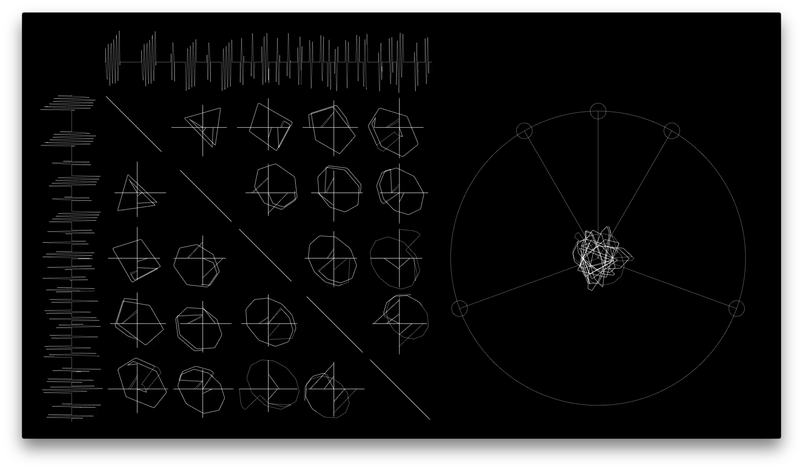
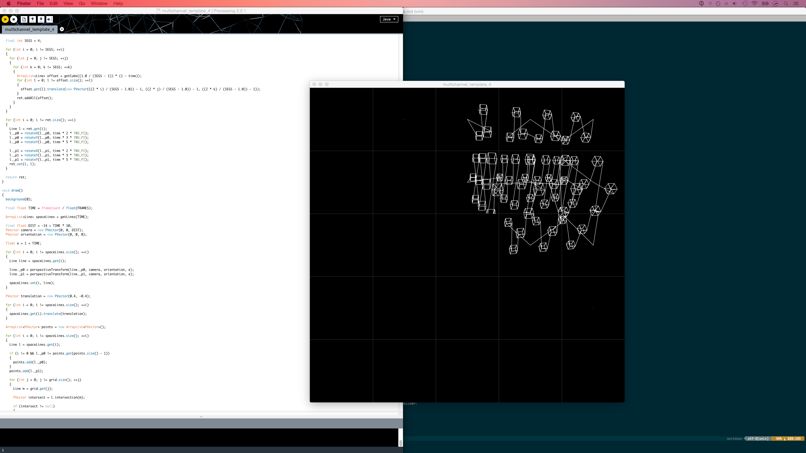
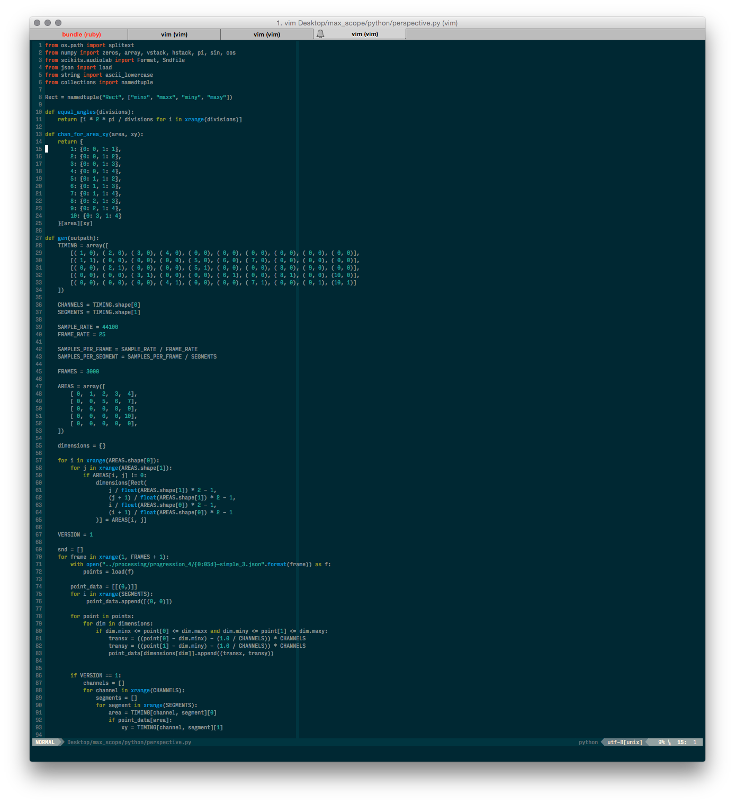
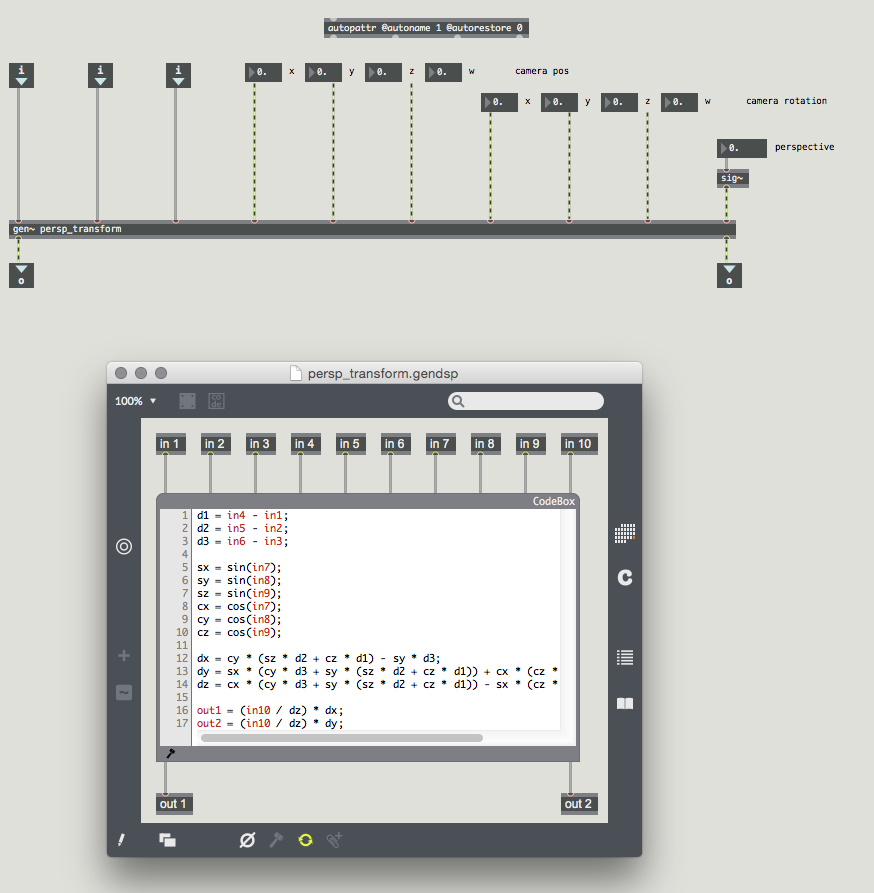
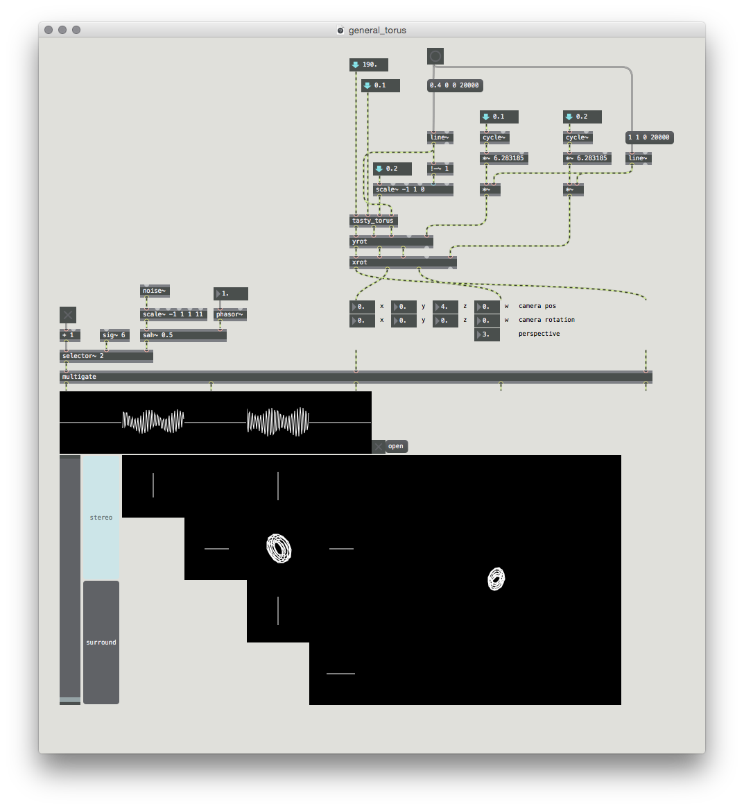

# introduction

`5chan_scope` is a multichannel audiovisual composition.
It explores the intersection of sound and image by displaying x/y plots of the waveforms for each pair of channels.
That is, everything that is seen is a direct, raw 'translation' of the audio.
The audio, in turn, is designed with the sole purpose of generating engaging visual results.

# background

From the outset, I knew I wanted to use the visual element of the piece to display an exact representation of the sonic component.
I’d experimented with lissajous figures in previous pieces, and wanted to see how far I could push the idea of drawing interesting patterns using only the sample values of waveforms.

This video shows an old lissajous pattern experiment.

<iframe src="https://player.vimeo.com/video/66002892" width="500" height="281" frameborder="0" webkitallowfullscreen mozallowfullscreen allowfullscreen>
Omitted: Lissajous pattern experiment video.
</iframe>

This is a music video I made at the end of 2nd year for a piece by Ben Potts, again featuring lissajous patterns prominently.

<iframe src="https://player.vimeo.com/video/127338610" width="500" height="281" frameborder="0" webkitallowfullscreen mozallowfullscreen allowfullscreen>
Omitted: Music video for Ben Potts.
</iframe>

Neither of these old experiments used audio signals to generate the lissajous patterns.
The first step of this project was to create a way of generating these patterns using audio, which led to one of the most fundamental guiding principles of the piece:

It was important that the piece did not become merely 'music with a visualiser'.
To prevent this, the visualiser and music were constructed so as to be mutually beneficial to one another.
The music was generated with attention to cross-correlation patterns between each pair of channels, with particular care given to the order and relative positions of each of the cross-correlation 'grid cells’.
If the music were played through a different visualiser, the results would be much less cohesive.
Similarly, if different music were played through the `5chan_scope` visualiser, it would likely produce no memorable cross-correlation patterns.
This need for inter-reliance between music and visual was represented by the following guiding heuristics:

> All decisions immediately affecting sound should be made with the sole purpose of improving the visual spectacle.
> All decisions immediately affecting the visuals should be made with the sole purpose of increasing sonic impact.
> Where a sonic choice will not affect the graphical outcome, take either choice.
> Where a graphical choice will not affect the sound, take either choice.

In this way, the visuals and sound were developed as a single entity, rather than following the more conventional approach of developing visuals, then developing sound, then putting the two together.

# influences

A few oscilloscope-music projects have been undertaken by various artists, but, to the best of my knowledge, all of these projects have been for stereo, rather than multichannel, sound.
Two of the most influential projects are described here.

## cyclo

The project I found most inspirational and aesthetically pleasing was Ryoji Ikeda and Carsten Nicolai's [Cyclo](www.raster-noton.net/shop/id).
A video excerpt is shown below:

<iframe src="https://player.vimeo.com/video/73860675" width="500" height="500" frameborder="0" webkitallowfullscreen mozallowfullscreen allowfullscreen>
Omitted: Video of cyclo.id#00.
</iframe>

In this project, the left and right sample values are treated as x and y coordinates, and each coordinate pair is plotted as a single dot.
The music is characterised by very high frequencies, often beyond the audible spectrum.
The graphics are monochrome, and mostly two-dimensional, but occasionally hint at three dimensions.

Though the use of high frequencies allows for a more detailed image (as there are more samples per frame), I did not particularly enjoy listening to the incredibly high pitches, and would prefer that the music inhabit a lower range.
As a result, I decided that I would aim to keep the majority of the sounds I produced within the audible spectrum, limiting myself to a sampling rate of 44100 Hz.
I very much like the visual language of Cyclo, and decided to take a similar approach in my piece, limiting myself to grey-scale colours.
I also wanted to take the idea of 3D lissajous patterns further, and decided to explore the rendering of 3D shapes in sound.

## jerobeam fenderson

[Jerobeam Fenderson](www.jerobeamfenderson.net) creates music to be displayed on oscilloscopes, using PureData.

<iframe width="500" height="281" src="https://www.youtube.com/embed/YqSvkNjWnnQ" frameborder="0" allowfullscreen>
Omitted: Video of Jerobeam Fenderson's Nucelar Black Noise.
</iframe>

Rather than the drawn-out drones with tiny modulations, seen in Cyclo's work, Jerobeam writes more traditionally 'musical' pieces with time-signatures, harmony, and instrument-like timbres.
Though musically interesting, at some points the sounds seem to have been created with *only* the sound in mind, leading to indistinct or jumbled visuals.
Jerobeam's work does show, however, that it is possible to create interesting figures without resorting to incredibly high frequencies.
This is in part due to the 'always-on' nature of the oscilloscope beam.
Instead of each sample creating a discrete dot, the oscilloscope smoothly interpolates between sample positions, resulting in lines rather than points.
While displaying my piece on an oscilloscope would be impractical or impossible, I decided to emulate similar behaviour  by 'joining up' sample positions with lines in my piece.

## other influences

The sonic language of Ryoji Ikeda - sparse, minimal and rhythmic - was a key inspiration.
Emptyset's protracted drones were another.
In both cases, although the individual sounds used may be harsh or uninteresting, by collecting, juxtaposing, and highlighting minute differences between instances, a great deal of interest is generated.
This attribute is also true of much ambient music, such as *Rubbish and Beauties* by Kissy Suzuki, or *Layering Buddha* by Robert Henke.

# creative process and tools

Process and tools were both intrinsically linked during the creation of `5chan_scope`.
First and foremost, I tried to think of myself as 'just another process'.
Just as the visualiser of the piece takes an audio input and produces a graphical output, I as a composer take 'inputs' in the form of environmental stimuli and then follow a series of (arguably non-deterministic) steps to produce an 'output'.
Some of these steps by necessity involve creating tools which can then run their own processes.

## visualiser

With an aesthetic in mind, the first step was to create a visualiser program which I could use to display whatever sounds I later made.
I used the [Cinder framework](http://libcinder.org/) and the [libsndfile library](http://www.mega-nerd.com/libsndfile/) to write a short C++ program which could read a multichannel audio file, use the sample data to produce a series of cross-correlation graphics, then write these to disk as a `.mov` file.
Unfortunately I did not keep a detailed record of how the visualiser progressed throughout the project.
However, the image below shows an early version.
Note the excessive visual noise: grid-lines, text labels, level meters on the left, and FFT displays at the bottom.

As the project progressed, I removed various elements of the visualiser, until I was left with just waveform displays, cross-correlation displays, and the custom multichannel-correlation display.
This allows a greater focus to be placed on the elements that are actually interesting.

The Cinder framework does not currently provide a way of writing audio streams alongside movie streams, so the visualiser program outputs a movie without any sound.
A collection of short shell-scripted invocations of the [FFmpeg program](www.ffmpeg.org) were used to add a multichannel audio stream to the muted video, and then pad the video with a few seconds of black frames at the beginning and end.

## sounds

Several different methods for producing sounds were used throughout the development of the piece.
Initially, the [Processing environment](https://processing.org/) was used to generate interesting visual gestures.
These gestures were built up from individual lines, and could be visualised in real-time using the Processing 'run' window.
The end-points of each line in the gesture could also be written to a [JSON](www.json.org) file, with one file per frame of the animation/gesture.
This image shows a Processing program along with its visual output.

These JSON files were then processed by a Python script which converted the end-point coordinates of each line segment into multichannel audio sample values.
The Python script used the `scikits.audiolab` wrapper over libsndfile to write out an audio file that could be used as an input to the visualiser.
This image shows part of the Python program.

This workflow emphasised a visuals-first approach, wherein the Processing program was used to create visual forms, and the Python program computed the necessary audio file to produce the same forms in the visualiser.
However, this often led to very unmusical results, and very different visual forms would often require very similar sounds.

I then took the important parts from the Processing and Python programs, and re-implemented them in Max/MSP.
This left me with a multitude of Max patches for a variety of interesting visual manipulations.
The majority of these patches were audio-rate objects, designed to work with groups of three signals, which were treated as 3D coordinates.
Patches for 3D rotation, translation, and for the production of geometric primitives were created, but the most important patch was the perspective transformer.
This patch allowed groups of three signals, treated as 3D coordinates, to be converted into pairs of signals which could be plotted in two dimensions, taking perspective into account.
Using the patch, any virtual 3D scene could be rendered as a 2D lissajous pattern.

This is the perspective transform Max/Gen patch:

The following patch was used to generate the 'spinning torus' visual at the beginning of the piece, which relies heavily on 2D representations of a 3D form.
The `tasty_torus` object generates a group of three signals, corresponding to instantaneous x, y, and z coordinates.
These coordinates are passed through two 3D rotations, then through the perspective transform.

With a toolkit of different Max objects for creating lissajous patterns, all that remained was to put them together in interesting ways, to produce different graphical figures.
Max was a great tool for this task, as it allowed me to rapidly prototype shapes, and then to instantly audition the sounds they produced.
I could also add interactive parameters to the patches, so that the shapes and sounds could be 'performed'.

# stylistic developments

At first, I wanted to write a very noise-based, rhythmic piece in the vein of Emptyset (but a little faster-paced).
My initial idea was to have two sets of sounds: 'musical' sounds with inconsequential cross-correlations, and 'drone' sounds which generated interesting visual patterns.
I would make some rhythmic music using the 'musical' sounds, and then intersperse this with the drone sounds to add visual interest.
Here are some of my primary ideas:

<iframe width="100%" height="450" scrolling="no" frameborder="no" src="https://w.soundcloud.com/player/?url=https%3A//api.soundcloud.com/playlists/102081791&amp;auto_play=false&amp;hide_related=false&amp;show_comments=true&amp;show_user=true&amp;show_reposts=false&amp;visual=true">
Omitted: Soundcloud audio demo player.
</iframe>

The 'Bass Drones' clip is an early example of the kind of sound-world I wanted to explore.
It uses long, noisy bass drones and clicky percussion, with occasional violent outbursts, and evolves very slowly.
This clip is purely musical - it does not produce any interesting visuals, but I thought I might be able to write oscilloscope music with a similar sound.

'Max Rhythm' is similar, but much cleaner and less violent.
This was my first attempt to 'make room' for sounds that would be visualised in interesting ways.

'Bass Ostinato' takes this idea even further, reducing the music to a single bass note followed by a noise burst.
The idea was to replace (or superimpose) my 'visual' sounds over the noise burst.

The '5-minute Demo' is the conclusion of this train of thought.
The entire demo is performed from within Max MSP using a custom sequencer patch.
All the material is constrained to a 12-step rhythmic grid, and for the most part the first ten steps of this grid are occupied by musical material, while the last two contain visual material.
The visual material involves cubes, generated using the Processing and Python code mentioned earlier, then loaded into a Max `sfplay~` and gated.

The video below shows the corresponding visualisation of the demo.
The audio quality of the video is poor as Youtube doesn't process loud multichannel audio properly, so I suggest that you listen to the audio from Soundcloud first to get a better idea of the sound-world.
Note the state of the visualiser program - at this point, I'd removed the level meters and FFT displays, but wasn't sure whether or not to keep the grid-lines and text labels.
I eventually decided that they didn't add anything to the video, and removed them.

<iframe width="500" height="281" src="https://www.youtube.com/embed/AkrWdc5HM2w" frameborder="0" allowfullscreen>
Omitted: Video of rhythmic demo.
</iframe>

Feedback on this demo was mixed.
The rhythmic elements were thought to be arbitrary, and the music was overly reliant on the 12-step grid.
Also, by constraining the 'visual' sounds to the last part of the bar, the listener knew exactly what to expect all the way through the piece.

Around this time, I realised that using 'musical' and 'visual' elements separately missed the point of the composition.
The entire piece should be created from visually interesting sounds.
I moved to a more free-form structure, in which there was no rhythmic grid, and concentrated on creating a meaningful progression of visual forms, limiting myself to toruses and regular polygons.
Instead of performing the entire piece in one take in Max, I performed and recorded each of the visual sections and transitions separately, and then stitched them together in a logic project.
Removing all the irrelevant rhythmic and cube-based material allowed me to focus more on small variations within drone-like 'shape-sounds', and the piece became much more cohesive and focused.

The new approach led to the following demo.

<iframe src="https://player.vimeo.com/video/123933759" width="500" height="281" frameborder="0" webkitallowfullscreen mozallowfullscreen allowfullscreen>
Omitted: Video of almost-complete piece.
</iframe>

Feedback on this version was much more positive, and I made just a few tweaks (removing the rhythmic grid at 1:06, drawing out some of the low notes, rehashing the ending) before producing the final composition.

<iframe src="https://player.vimeo.com/video/126071219" width="500" height="281" frameborder="0" webkitallowfullscreen mozallowfullscreen allowfullscreen>
Omitted: Video of final piece.
</iframe>

# aesthetic decisions

The music is composed quite freely, and there is no overarching algorithm or pattern that dictates the ordering or timing of each section.
Instead, the piece is put together quite intuitively, and I have tried to *imply* progressions throughout the piece, rather than setting up specific rules or orderings to govern the composition.
This was intentionally designed to contrast with the concrete, prescriptive approach to the visual material.
Whereas the visualiser uses a single set of rules to generate graphics, the music is designed to produce a wide range of visual effects in a more fluid, human way, challenging the rigidity of the visual process.
This, I think, is reflective of my wider creative practice: I try to set up constraints, and then push my work to the very limits of those constraints.

There are three main visual motifs in `5chan_scope`:

* The '3D torus' motif, based on a coiled doughnut-like shape
* The 'regular polygons' motif, based on regular polygons with between 3 and 100 sides
* The 'random movement' motif, in which a shape is rapidly moved between grid cells (corresponding to channel-pairs)

I chose these particular motifs because they each have a distinctive visual and sonic character that can be differentiated easily.
Additionally, the simplicity of each individual motif allows for interesting but understandable interactions when the motifs are combined.
The small number of motifs used is consistent with the minimal aesthetic suggested by the sparse, monochromatic visuals and the drone-like audio.
A wider selection of motifs may have led the piece to become confused or muddled.

The piece begins with a series of variations on the torus motif.
This takes place on the front left and right channels, occupying a single grid-cell on screen.
The first section also serves to establish a clear link between sound and visuals - as more 'coils' are added to the shape rotating on screen, different harmonics can be heard in the sound.

At 1:09, the random movement motif is introduced for the first time, as a treatment on top of the torus motif.
This motif continues, as the minor radius of the torus decreases, and the shape morphs into a simple 2D circle.
In 2D, the random movements are emphasised, and become the new focus.
The fundamental frequency rises then plateaus, and at 2:10 the harmonics rapidly increase in volume as the circle loses some of its edges to become a triangle.
This is the first statement of the regular polygons motif.

Now, the rapid movement motif is altered slightly, becoming a regular, predictable movement.
The 2D shape moves between each of the grid cells in turn, adding a side to the regular polygon shown each time.
The rate of movement increases, and as it does so, the 2D polygons rotate slowly in 3D space, becoming regular prisms.

After a brief pause, a new technique is shown at 3:20 - a 2D regular polygon is slowly drawn, but it crosses between the grid cell boundaries.
This is achieved by using a very fast version of the regular movement motif.
The polygon decreases in size, until it occupies a single cell once more.
After a short reprise of the random movement motif, the shape extrudes outwards and starts rotating.
This is a mixture of the torus and polygon motifs - the shape here is a torus with a polygonal cross-section.

At 4:17, the number of sides of the cross-section increases, and the shape becomes a simple torus once more.
As the torus decreases in size, it briefly references the beginning of the piece, and as the visual shrinks off the screen, the sound fades to silence.

# evaluation

I'm pleased with the final composition.
I am especially pleased with the use of multiple channels, for example when a particular graphical figure 'overlaps' several channels.
My main disappointment is to do with material that I omitted.
Though I think the piece benefits from the simplicity of containing just a few visual motifs, I generated a great deal of material, most of which did not make it into the final piece as it was too different.
If I were to start from scratch, I might attempt to integrate a few more ideas, perhaps making a feature out of contrasting material, rather than attempting to create a single unbroken narrative.
Additionally, I enjoy writing rhythmic music, so it was a shame not to use any of these ideas in the final piece.
All in all, writing this composition was challenging but a lot of fun, and I'm considering using the techniques I developed to write a longer-form piece or collection of pieces, using some of my left-over material.
